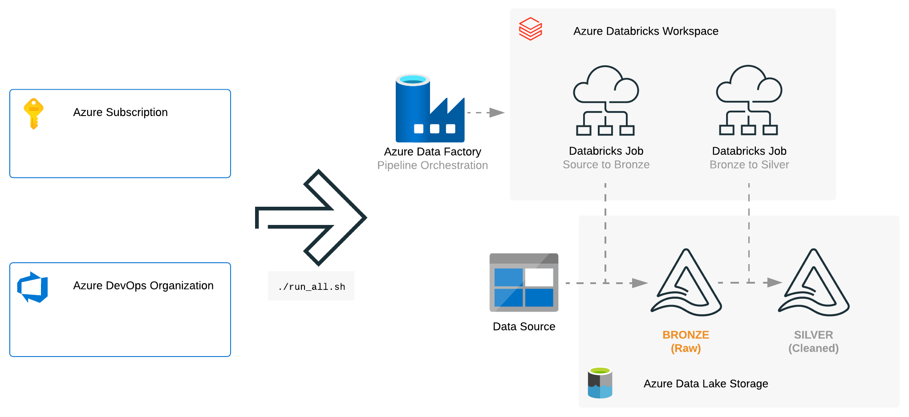
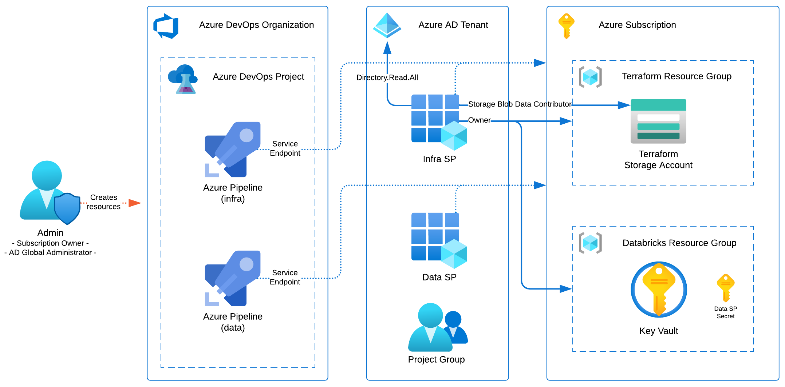
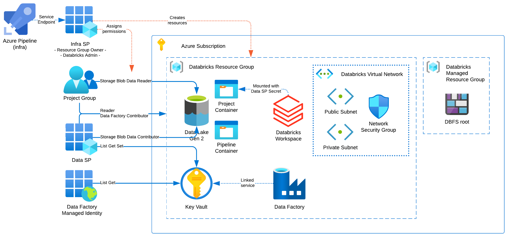
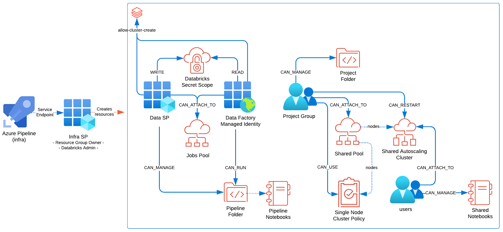

# azdo-databricks

-----------

This repository contains examples of Azure DevOps (azdo) [Pipelines](https://docs.microsoft.com/en-us/azure/devops/pipelines/get-started/what-is-azure-pipelines) that demonstrate how an end-to-end Azure Databricks workspace automation could be done.

The Azure Pipelines can use either [Terraform](pipelines/azure-pipelines-infra-with-terraform.yml) or [scripts](pipelines/azure-pipelines-infra-with-azure-cli.yml) (with Azure CLI and ARM templates).

The main goal is to have a Databricks Delta pipeline orchestrated with Azure Data Factory while starting with an empty Azure account (with only an empty Subscription and DevOps Organization).
  - all of this by simply running `./run_all.sh`:



## [Quick start](id:start)

1) Create the Subscription and DevOps Organization. If using the free tier, request a free Azure DevOps Parallelism grant by filling out the following form: https://aka.ms/azpipelines-parallelism-request

2) Customize the variables:
    - admin setup variables: edit the `admin/vars.sh` [file](admin/vars.sh)
    - Azure Pipelines variables: edit the `pipelines/vars.yml` [file](pipelines/vars.yml), commit and push changes

3) Use the `run_all.sh` [script](run_all.sh):
```
export USE_TERRAFORM="yes"
export AZURE_DEVOPS_ORG_URL="https://dev.azure.com/myorg/"  # or set it in vars.sh
export AZURE_DEVOPS_EXT_PAT="xvwepmf76..."                  # not required if USE_TERRAFORM="no"
export AZURE_DEVOPS_EXT_GITHUB_PAT="ghp_9xSDnG..."          # GitHub PAT

./run_all.sh
```

## [Main steps](id:steps)

Security was a central part in designing the main steps of this example and reflected in the minimum user privileges required for each step:
  - step 1: administrator user (`Owner` of Subscription and `Global administrator` of the AD)
  - step 2: infra service principal that is Owner of the project Resources Group
  - step 3: data service principal that can deploy and run a Data Factory pipeline

### [Step 1: Azure core infrastructure (admin setup)](id:step1)



Builds the Azure core infrastructure (using a privileged user / Administrator):
- this is the foundation for the next step: Resource Groups, Azure DevOps Project and Pipelines, Service Principals, Project group and role assignments.
- the user creating these resources needs to be `Owner` of Subscription and `Global administrator` of the Active Directory tenant.
- it can be seen as deploying an empty shell for a project or business unit including the Service Principal (the `Infra SP`) assigned to that project that would have control over the project resources.

To run this step use one of the s4cripts depending on the tool preference:
- Terraform: `./admin/setup-with-terraform.sh` ([code](admin/setup-with-terraform.sh))
- Scripts with Azure CLI: `./admin/setup-with-azure-cli.sh` ([code](admin/setup-with-azure-cli.sh))

Before using either, check and personalize the variables under the `admin/vars.sh` [file](admin/vars.sh).


### [Step 2.1: Azure infrastructure for the data pipeline and project](id:step2.1)



Builds the Azure infrastructure for the data pipeline and project (using the project specific `Infra SP`):
- this is the Azure infrastructure required to run a Databricks data pipeline, including Data Lake Gen 2 account and containers, Azure Data Factory, Azure Databricks workspace and Azure permissions.
- the service principal creating these resources is the `Infra SP` deployed at [step 1](admin/terraform/main.tf#L61) (Resource Group [owner](admin/terraform/main.tf#L87)).
- it is run as the [first stage](pipelines/azure-pipelines-infra-with-terraform.yml#L64) in the Azure DevOps [infra pipeline](admin/terraform/main.tf#L158) with the pipeline name defined in the [AZURE_DEVOPS_INFRA_PIPELINE_NAME](admin/vars.sh#L46) variable.
- there are two Azure Pipelines yaml definitions for this deployment and either one can be used depending on the tool preference:
   - Terraform: `pipelines/azure-pipelines-infra-with-terraform.yml` ([code](pipelines/azure-pipelines-infra-with-terraform.yml))
   - ARM templates and Azure CLI: `pipelines/azure-pipelines-infra-with-azure-cli.yml` ([code](pipelines/azure-pipelines-infra-with-azure-cli.yml))

To run this step:
- either use the az cli command like `run_all.sh` [does it](run_all.sh#L44).
- or use the Azure DevOps portal by clicking the `Run pipeline` button on the pipeline with the name defined in the [AZURE_DEVOPS_INFRA_PIPELINE_NAME](admin/vars.sh#L46) variable.

Before using either, check and personalize the variables under the `pipelines/vars.yml` [file](pipelines/vars.yml) (don't forget to push any changes to Git before running).


### [Step 2.2: Databricks workspace bootstrap](id:step2.2)



This step is executed together with the one above and after deploying the Azure infrastructure and the Databricks workspace itself:
- it bootstraps the Databricks workspace with the required workspace objects for a new project and pipeline, including Instance Pools, Clusters, Policies, Notebooks, Groups and Service Principals.
- the service principal creating these resources is the `Infra SP` deployed at [step 1](admin/terraform/main.tf#L61) and is already a Databricks workspace admin since it [deployed the workspace](terraform/deployments/azure-infrastructure/databricks-workspace.tf).
- it is run as the [second stage](pipelines/azure-pipelines-infra-with-terraform.yml#L93) in the Azure DevOps [infra pipeline](admin/terraform/main.tf#L158) with the pipeline name defined in the [AZURE_DEVOPS_INFRA_PIPELINE_NAME](admin/vars.sh#L46) variable.

This is run together with previous step but if it is needed to run it separately:
- in the Azure DevOps portal, before clicking the `Run pipeline` button on the Infra pipeline, deselect the `Deploy infrastructure` job.
- with Terraform, use the `terraform/deployments/run-deployment.sh` script [file](terraform/deployments/run-deployment.sh).


### [Step 3: Azure Data Factory data pipeline with Databricks](id:step3)


This step is executed after the infrastructure deployment and workspace bootstrap:
  - it's a simple Azure DevOps [Pipeline](pipelines/azure-pipelines-data-factory-msi.yml) that deploys with ARM templates an Azure Data Factory [data pipeline](arm/azure-data-factory-pipeline.json) together with the Databricks [linked service](arm/azure-data-factory-linkedservice-databricks-msi.json).
  - it then [invokes](pipelines/azure-pipelines-data-factory-msi.yml#L202) the Azure Data Factory data pipeline with the Azure DevOps Pipeline [parameters](pipelines/azure-pipelines-data-factory-msi.yml#L39).
  - the service principal deploying and running the pipeline is the `Data SP` deployed at [step 1](admin/terraform/main.tf#L69) and it has the necessary [Databricks](terraform/deployments/workspace-bootstrap/principals.tf#L20) and [Data Factory](terraform/deployments/azure-infrastructure/azure-infrastructure.tf#L78) permissions given at step 2.
  - this service principal also has the [permission](terraform/deployments/azure-infrastructure/azure-infrastructure.tf#L14) to write data into the Data Lake.
  - the Databricks linked service can be of two types:
    - using the Data Factory Managed Identity to authenticate to Databricks: `pipelines/azure-pipelines-data-factory-msi.yml` ([code](pipelines/azure-pipelines-data-factory-msi.yml))
    - using an AAD Access Token of the `Data SP` to authenticate to Databricks: `pipelines/azure-pipelines-data-factory-accesstoken.yml` ([code](pipelines/azure-pipelines-data-factory-accesstoken.yml))

To run this step:
- either use the az cli command like `run_all.sh` [does it](run_all.sh#L67).
- or use the Azure DevOps portal by clicking the `Run pipeline` button on the pipeline with the name defined in the [AZURE_DEVOPS_DATA_PIPELINE_NAME](admin/vars.sh#L49) variable.

It will use some of the variables under the `pipelines/vars.yml` [file](pipelines/vars.yml) and it can be customized using [pipeline parameters](pipelines/azure-pipelines-data-factory-msi.yml#L39) like database and table names, source data location, etc.
